## 1. Введение 

1. Начнем с создания миграции

```python
python manage.py makemigrations
```

2. Создадим таблицы в базе данных (БД)
```python
python manage.py migrate
```

3. Запустим сервер
```python
python manage.py runserver
```

Перейдем по http://127.0.0.1:8000/ и увидим, что чего-то не хватает. Так как основное наполнение идет через базу данных 
(БД). Для этого произведем загрузку(перенос) данных в БД из её фикстуры(слепка). В фикстуре содержится вся информация о заполнении БД.
Однако, фикстура это всего лишь заполнение БД, без структуры (какие именно таблицы и какие есть связи в БД), которую 
мы переносили при помощи команды (`migrate`) фикстуру не применить.

Ознакомьтесь с содержанием файла `data_db.json` по ключевому слову `app.entry` в этом файле найдите статьи, ознакомьтесь с
полями у этой таблицы.

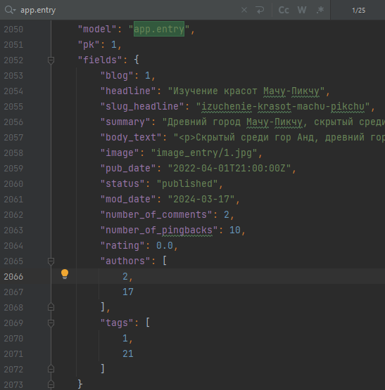

4. Теперь загрузим эти данные (фикстуру)
```python
python manage.py loaddata data_db.json
```

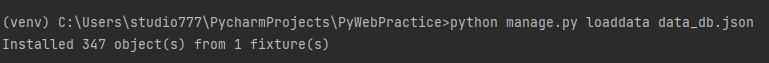

Так как данные уже есть в БД, то `Блог` показывает нужную информацию.

В `readme.md` в корне проекта описано, что есть в данном репозитории и что реализовано,
а что нет, с точки зрения функционала данного приложения `Блог`.

## 2. Знакомство с административной панелью

Django в отличие от большинства других библиотек или фреймворков обладает встроенной административной панелью (но и в других 
библиотеках можно скачать модулю которые закроют данный функционал, если он требуется). Административная панель это страница, с
базовыми функциями для администрирования сайта. С помощью админ понели достаточно просто и удобно работать со значениями таблиц БД. 

Чтобы зайти в неё достаточно перейти по адресу http://127.0.0.1:8000/admin

В курсах ранее мы с вами создавали суперпользователя(он же админ) используя команду `manage.py createsuperuser`, но 
пока этого не нужно, необходимые пользователи и админ был загружен через фикстуру.

Зайдите в админ панель по адресу http://127.0.0.1:8000/admin под: 

Username: `admin`
Password: `123`

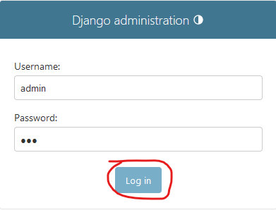

Затем попадаете в само отображение админ панели, где на данный момент есть 2 блока
`Authentication and Authorization` и `Приложение`. 


Визуальное отображение админ панели можно изменить при помощи сторонних библиотек, кому интересно, то подробнее 
можно почитать [здесь](https://docs.google.com/document/d/1S9bGmy-83u-7P2b-Kpt1tVUQqiBAGRS5RUxyJkLQ6yQ/edit?usp=sharing) (информация только для интересующихся, 
выполнять в рамках практики примеры из материала не нужно).

### 2.1 Аутентификация и авторизация

Первый блок посвящен системе аутентификации (определение кто зашел на страницу, какой пользователь) 
и авторизации (определение какие права есть у данного пользователя, что ему можно показывать, а что нет)

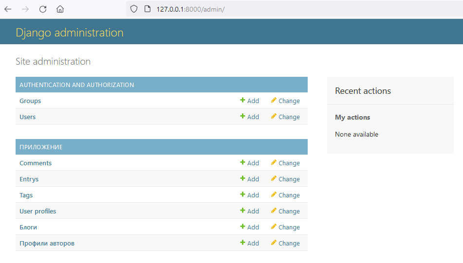

Все пользователи содержатся в `Users`, зайдите на вкладку и посмотрите на текущих пользователей в БД. Всего будет 41 пользователь,
Один админ, 5 пользователей со статусом персонала (staff status будет с зеленой галочкой) и 35 обычных пользователей.

Создайте нового пользователя через admin панель, для этого нажмите на `+Add` на левой панели в строке `Users`.

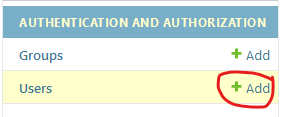

Придумайте Username, а также пароль, повторите пароль. В этот раз придётся соблюсти правила защищенного пароля. 
`123456 не пропустит форма`, но чтобы не выдумывать сложный пароль для теста, можно на английской клавиатуре пробежаться 
змейкой от 1 вниз до 2 вверх с зажатым Shift. Пароль тогда будет такой `!QAZXSW@` такой пароль Django пропустит. Затем
нажмите на `Save`

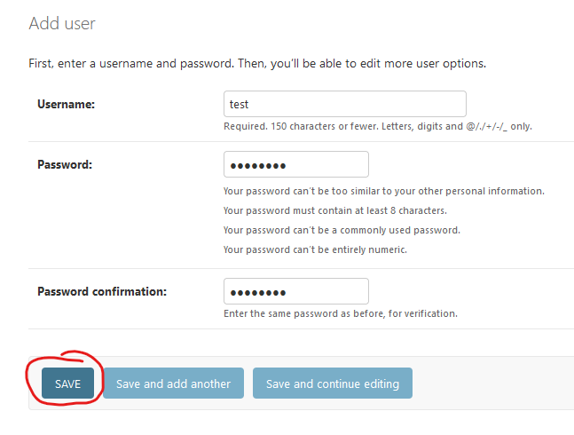

Далее появится дополнительная информация о пользователе, где можно заполнить персональные данные, а также поработать с 
разрешениями (permissions) и если это необходимо наделить созданного пользователя правами персонала (staff status) или админа 
(superuser status). Также возможно добавить пользователя в определенные группы разрешений (про это рассмотрим далее).

Если сделали какие-то изменения на данной странице, то чтобы они принялись, то необходимо внизу страницы нажать на `Save`

Далее перейдите в таблицу `Groups` в левой панели, и вы увидите, что уже есть одна группа, она была загружена из фикстур, это группа `Авторы`

Создайте новую группу, название на ваше усмотрение, в моём случае пусть это будет `Группа`, далее вы можете раздать определенные права пользователям на действия над данными в этой группе.

Допустим можно делать следующие действия со строками в таблицах БД:
* добавлять данные (Can add)
* изменять данные (Can change)
* удалять данные (Can delete)
* просматривать данные (Can view)

Возьмите и перенесите права над `auth | user` из левой колонки в правую, для этого нажмите двойной щелчок левой кнопки мыши на необходимой
строке права или выделите строку и нажмите на символ стрелки вправо.

Сохраните данную группу.

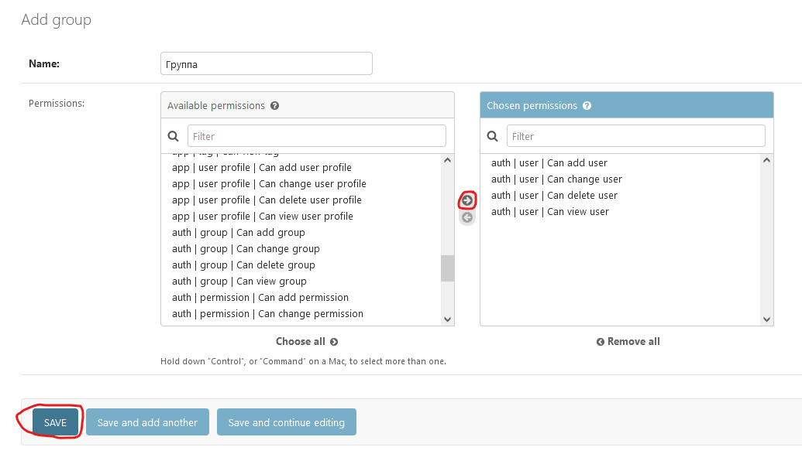

Теперь перейдите в таблицу `Users` и нажмите на пользователя `amoskonstantinov`, чтобы изменить значения его значений в БД.

Пролистаем вниз до поля `Groups` и перенесем в правую таблицу вашу созданную группу, если делали как и я, то это будет `Группа`

Чуть ниже есть возможность раздавать права отдельным пользователям (если это необходимо), а не целой группе.

Обязательно сохраняем изменения! Нажимаем на `Save`.

Теперь проверим, что поменялось после раздачи прав. Разлогинимся, для этого справа вверху есть `LOG OUT`

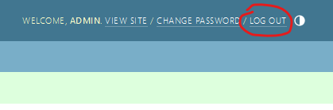

И теперь залогинимся под недавно измененным пользователем 

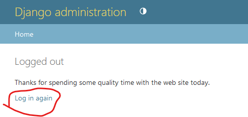

Username: `amoskonstantinov`
Password: `Or5G_uRh)V`

И вы увидите, что этому пользователю доступны только действия над элементами таблицы `Users` в БД, ровно то, что 
мы и разрешали для группы.

Если зайти под пользователем с staff status, но без единого разрешения, то страница будет достаточно пустой, как на примере
данного пользователя

Username: `budimir2021`
Password: `J2GzZvp!_c`

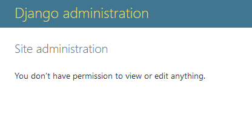

А если зайти под обычным пользователем, не персоналом, то в админ панель его не пустят, как например

Username: `arhip_35`
Password: `RbT9Zu7rg%`

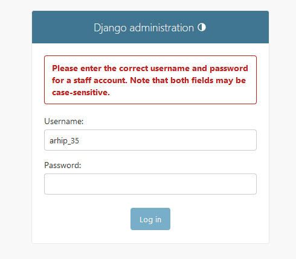

Пароли и username остальных пользователей (если это необходимо) приведены в `users.json` в корне проекта

### 2.2 Основные таблицы приложения Блог

В приложении существует 6 таблиц

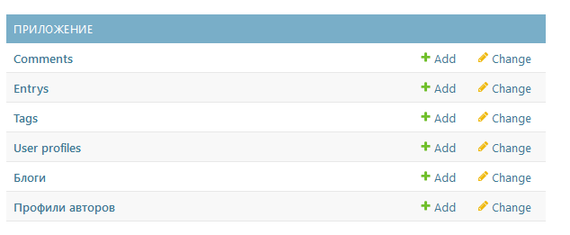

* `Comments` - таблица с комментариями	

* `Entrys` 	- таблица с записями статей

* `Tags`	- таблица с тегами статей

* `User profiles` - таблица с профилями пользователей	

* `Блоги`	- таблица с существующими блогами в приложении

* `Профили авторов`- таблица с профилями авторов

Добавим новую статью на блог-платформу, для этого нажмем на `+Add` в строке `Entry`

Создайте новую статью. Жирным выделены названия тех параметров, что обязательны для заполнения. Картинку можете загрузить свою, если есть желание
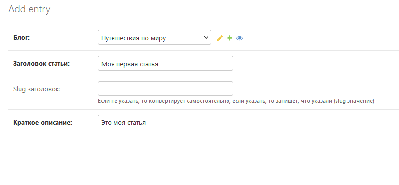

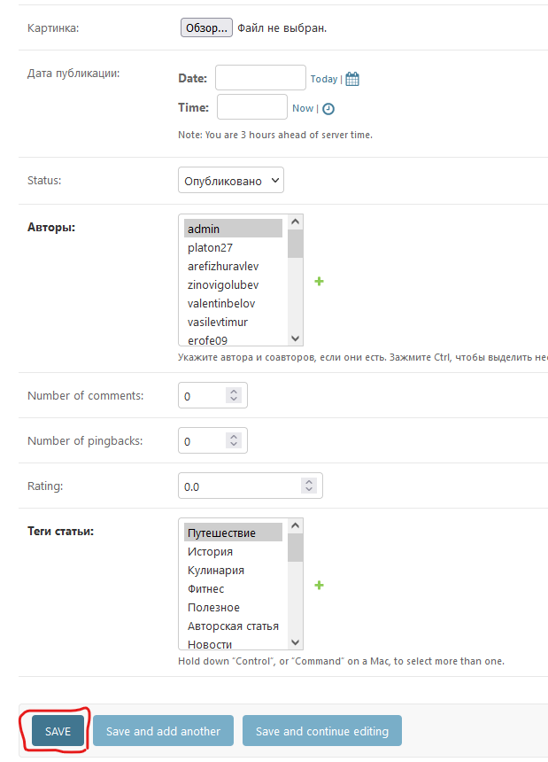

После заполнения создайте свою первую запись на платформе через админ панель.

Теперь в БД есть запись созданная через админ панель.

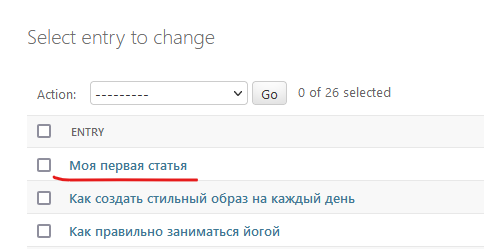

Наблюдать за результатом возможно на главной странице приложения. http://127.0.0.1:8000/

Пролистайте начальную страницу немного вниз и увидите свой пост.


Однако к БД можно подключить не только через админ панель, но и через любой обозреватель БД поддерживающий данную БД.
По умолчанию БД в Django создаётся через SQLite, наша БД не исключение (в будущем рассмотрим извeстную нам PostgreSQL).

К SQLite можно подключиться через [SQLiteBrowser](https://sqlitebrowser.org/dl/) или [DBeaver (Community)](https://dbeaver.io/download/) 
или другие менеджеры и обозреватели БД.

Рассмотрим `Dbeaver`.

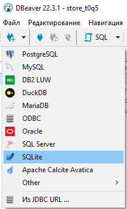

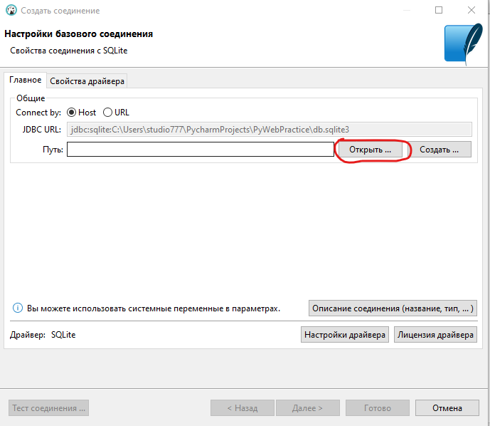

Открываем базу данных из проекта

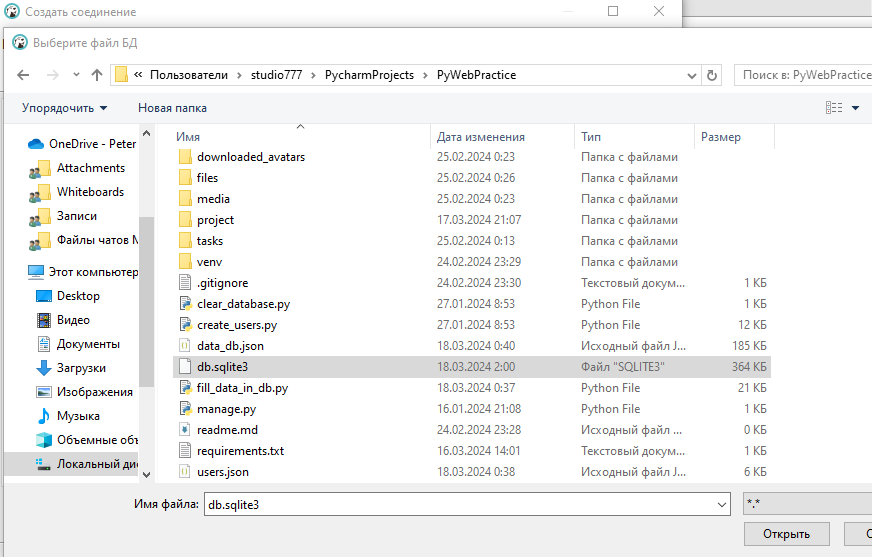

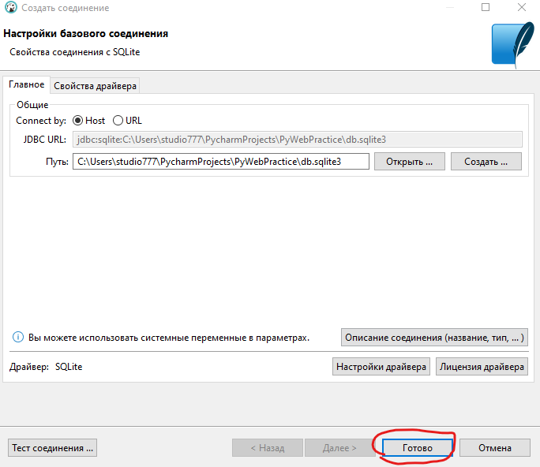

И если это необходимо используем данные из таблиц

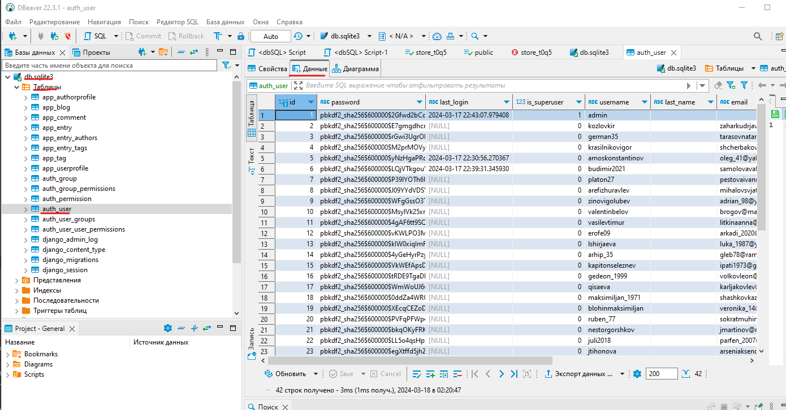

Далее разберем как создать свои модели (таблицы в БД) в Django и как можно получать информацию из БД не через админ панель.

## Создание моделей в Django

Модели - это класс в котором описывается наполнение таблицы в БД и определенные связи. 
Модель состоит из названия таблицы и наполнения полей которые там участвуют + дополнительные параметры и возможности.

Стандартно модели прописываются в файле `models.py` своего приложения. 

Откройте файл `models.py` приложения `db_train`, которое находится в папке `apps`

Создадим модель `Author`, для этого необходимо создать одноименный класс `Author`, который наследуется от `models.Model`

```python
class Author(models.Model):
    pass
```

Теперь наполним данную модель(таблицу) описанием полей(колонок) которые она буде хранить.

Для создания поле внутри класса пишут классовую переменную, причем название классовой переменной соответствует названию поля в 
БД которое мы хотим создать для хранения там данных. В классовую переменную записывается экземпляр созданный на базе определенного типа данных.

Например:

```python
class Author(models.Model):
    first_name = models.CharField()
```

Данным кодом было объявлено поле `first_name`, которое представляет собой строковый тип (CharField). Говорящее о том, что в данном поле
будут храниться данные в строковом типе.

ORM Django поддерживает множество типов рассмотрим часто применяемые:
* Целые числа - `models.IntegerField()`;
* Вещественные числа - `models.FloatField()` для чисел типа float, `models.DecimalField` для чисел с фиксированной точностью 
(допустим финансовых операций с 2-умя значениями после запятой);
* Булевые значения - `models.BooleanField()` для хранения `True` или `False`;
* Поле для хранения бинарных данных - `models.BinaryField()`. Допустим так можно сохранить документ или картинку в базу данных целым файлом;
* Строки - `models.CharField()` для небольших предложений или слов размером до 255 символов, можно явно указать максимальный размер строки;
* Многострочный текст - `models.TextField()` для больших предложений;
* `models.EmailField()`
* `models.SlugField()`
* `models.DateField()`
* `models.DateTimeField()`
* `models.FileField()`
* `models.ImageField()`

Более детально про эти и другие типы можно прочитать в [документации](https://docs.djangoproject.com/en/5.0/ref/models/fields/#field-types) 
или в файле в `fields_and_types.md` в разделе `1. Описание полей`


Предположим, что в начальной стадии (не задумываясь о том как будем работать со сложными связями и таблицами) 
нам достаточно следующих данных для структуры хранения данных в таблице `Author`:

| Поле     | Имя поля    | Тип поля  | Какой класс используется для описания |
|----------|-------------|-----------|---------------------------------------|
| имя      | first_name  | строковое | models.CharField                      |
| фамилия  | last_name   | строковое | models.CharField                      |
| отчество | middle_name | строковое | models.CharField                      |


* имя (first_name) [строковый тип]
* фамилия (last_name) [строковый тип]
* отчество (middle_name) [строковый тип]
* 


Далее определимся с параметрами которые покажут как будем использовать то или иное поле. 


Подробнее про поля и параметры передаваемые можно прочитать в `fields_and_types.md`

https://docs.djangoproject.com/en/5.0/ref/models/fields/#field-options


## Написание запросов в БД используя ORM Django


## Подключение к БД через SQLite и python (опционально)

