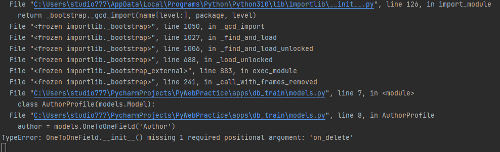
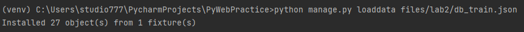

Ранее рассматривали создание таблиц в БД и запросов, теперь рассмотрим как сформировать отношения между таблицами

Сделайте merge ветки lab2 в ветку master, чтобы подгрузить руководство для второй практики. 


Затем вернем авторов на место, так как ранее частично удаляли их

```python
python manage.py loaddata files/lab1/data_author.json
```

## 1. Отношения таблиц

В Django, существует несколько типов отношений между таблицами, которые 
определяются с помощью ORM модели данных. Отношения могут быть:
* один-к-одному(One-to-One), 
* один-ко-многим(One-to-Many),
* многие-ко-многим(Many-to-Many). 
 
Давайте рассмотрим каждый тип:

1. Связь `Один-к-одному (One-to-One)`:

В отношении "один-к-одному" каждая запись одной таблицы связана с одной записью в другой таблице.
Часто такая таблица используется для расширения другой таблицы без изменения первоначальной. 
В Django это можно реализовать с помощью поля `OneToOneField`.

Вот пример, допустим мы захотели добавить данных в таблицу `Author`, но там и так уже очень много колонок. Можно создать отдельную
таблицу `AuthorProfile` и связать её с `Author` отношением один-к-одному. Таким образом ещё возможно разграничить доступ к таблицам, 
допустим к таблице `Author` есть доступ у всех, а к `AuthorProfile`, только у определенных пользователей.

В `models.py` приложения `apps/db_train` добавьте следующую таблицу.

```python
class AuthorProfile(models.Model):
    author = models.OneToOneField('Author')
    stage = models.IntegerField(default=0, 
                                blank=True,
                                verbose_name="Стаж",
                                help_text="Стаж в годах")
```

Через некоторое время выйдет предупреждение, что пропущен позиционный аргумент `'on_delete'`, Django хочет знать, что делать с данным связанным полем после удаления.



В контексте Django, параметр `on_delete` относится к внешнему ключу (foreign key), который определяет связь между двумя таблицами. 
Он указывает, что произойдет с записями в связанной таблице, если запись в родительской таблице будет удалена.

Т.е. в данном примере, необходимо указать, что делать со значением поля `author` в таблице `AuthorProfile` в случае удаления
связанной с ней строки таблицы `Author`

Параметр `on_delete` может принимать различные значения в зависимости от желаемого поведения при удалении связанной записи:

* `CASCADE`: Если запись в родительской таблице удаляется, все связанные записи в дочерней таблице также будут удалены.


* `PROTECT`: Запрещает удаление записи в родительской таблице, если на нее есть ссылки из дочерних таблиц. В этом случае будет вызвано исключение ProtectedError.


* `SET_NULL`: При удалении записи в родительской таблице, внешний ключ в дочерней таблице будет установлен в NULL. Это предполагает, что поле внешнего ключа разрешает значение NULL.


* `SET_DEFAULT`: При удалении записи в родительской таблице, внешний ключ в дочерней таблице будет установлен в значение по умолчанию.


* `SET`: При удалении записи в родительской таблице, внешний ключ в дочерней таблице будет установлен в указанное значение.


* `DO_NOTHING`: Ничего не делать. В этом случае будет оставлено на усмотрение базы данных обработка удаления записи в родительской таблице.


Воспользуемся чаще всего используемым параметром `models.CASCADE`, говорящей о том, что если автор будет удалён, то и его профиль тоже будет удалён.

```python
class AuthorProfile(models.Model):
    author = models.OneToOneField('Author', on_delete=models.CASCADE)
    stage = models.IntegerField(default=0, 
                                blank=True,
                                verbose_name="Стаж",
                                help_text="Стаж в годах")
```

Теперь две таблицы связаны отношением один к одному.

Создайте миграцию

```python
python manage.py makemigrations
```

И перенесите её в БД

```python
python manage.py migrate
```

2. Связь `Один-ко-многим (One-to-Many)`:

В отношении "один-ко-многим" каждая запись одной таблицы связана с несколькими записями в другой таблице. В Django это можно реализовать с помощью поля `ForeignKey`.

Пример: Создадим таблицу Entry(статья) которая будет связана с автором, но автор может создать несколько статей, и все они будут привязаны к автору, здесь
поможет отношение "один-ко-многим", где один автор может написать много статей.

В `models.py` приложения `apps/db_train` добавьте следующую таблицу.

```python
class Entry(models.Model):
    text = models.TextField(verbose_name="Текст статьи",
                            )
    author = models.ForeignKey("Author", on_delete=models.CASCADE, related_name='entries')
```

Здесь `related_name` используется для более удобному обращению к записям, через автора, т.е. в объекта автор появится мнимое поле, 
которого не существует в БД, но будет связь со всеми его статьями через поле `'entries'` эту связь также называют обратная связь.


Создайте миграцию

```python
python manage.py makemigrations
```

И перенесите её в БД

```python
python manage.py migrate
```

3. Связь `Многие-ко-многим (Many-to-Many)`:


В отношении "многие-ко-многим" несколько записей одной таблицы связаны с несколькими записями в другой таблице. В Django это реализуется с использованием поля `ManyToManyField`.

Пример: Создадим таблицу Tag(тэг) которая будет связана со статьей, но в одной статье может быть несколько тегов, а один тег использоваться в нескольких статьях, 
здесь поможет отношение "многие-ко-многим".

В `models.py` приложения `apps/db_train` добавьте следующую таблицу.

```python
class Tag(models.Model):
    name = models.CharField(max_length=50,
                            verbose_name="Название",
                            )
```

Теперь в `Entry` добавим поле `tags` чтобы хранить там ключи к тегам.

```python
class Entry(models.Model):
    # ...
    tags = models.ManyToManyField("Tag", related_name='entries')
```

Создайте миграцию

```python
python manage.py makemigrations
```

И перенесите её в БД

```python
python manage.py migrate
```

Далее покажем созданные таблицы в админ панели. (Вспомните на основе прошлой практики как регистрировать модели в `admin.py` для отображения в админ панели)

Теперь зайдём через админ панель и создадим пару строк в БД.

Начнем с тегов. Создадим 3 тега. "Кино", "Музыка", "Искусство"

Переопределите метод `__str__` в классах `AuthorProfile`, `Entry`, `Tag` по своему желанию, для более читаемого отображения строк в админ панели.

Если это необходимо, то к полям связанной модели можно обращаться через `.`, допустим так для `__str__` модели `AuthorProfile`

```python
class AuthorProfile(models.Model):
    # ...
    
    def __str__(self):
        return f"Автор: {self.author.username}; Стаж: {self.stage} лет"
```

Затем создайте пару записей в таблице `Entrys` в админ панели. Чтобы выбрать несколько тегов, зажмите `Ctrl`.

И создайте пару записей в `Authors profile`

Далее будем работать с запросами с БД, и нужны общие данные, чтобы проверить правильность выполнения запросов, поэтому чтобы не терять ваш
труд, то скопируем (`dumpdata`) данные из таблицы `db_train` в фикстуру, для этого выполним команду

```python
python -Xutf8 manage.py dumpdata --indent 4 db_train > my_db_train.json
```

Можете посмотреть созданный файл, что скопировалась только таблица `db_train` с вашими данными. Флаг `-Xutf8` используется
для переноса в кодировке utf-8, чтобы кириллица нормально отображалась.

Затем вставим данные в БД, чтобы заполнение было одинаковое.

```python
python manage.py loaddata files/lab2/db_train.json
```




## 2. Создание запросов

Чтобы полноценно ознакомиться с запросами и работой связанными таблицами сначала 

Добавить `'apps.db_train_alternative'` в `settings.py` в `INSTALLED_APPS`

Вывод результатов в HTML


## 3. Подключение PostgreSQL


## 4. Работа с Django debug tool bar


## Подключение к БД через модули python

sqlite3

SQLAlchemy


