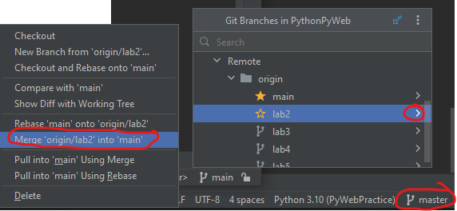

Ранее рассматривали создание таблиц в БД и запросов, теперь рассмотрим как сформировать отношения между таблицами

Сделайте merge ветки lab2 в ветку master, чтобы подгрузить руководство для второй практики. 



Затем вернем авторов на место, так как ранее частично удаляли их

```python
python manage.py loaddata files/lab1/data_author.json
```

## 1. Отношения таблиц

В Django, существует несколько типов отношений между таблицами, которые 
определяются с помощью ORM модели данных. Отношения могут быть:
* один-к-одному(One-to-One), 
* один-ко-многим(One-to-Many),
* многие-ко-многим(Many-to-Many). 
 
Давайте рассмотрим каждый тип:

Один-к-одному (One-to-One):


## Подключение к БД через модули python

sqlite3

SQLAlchemy


