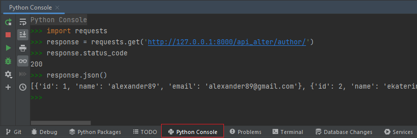
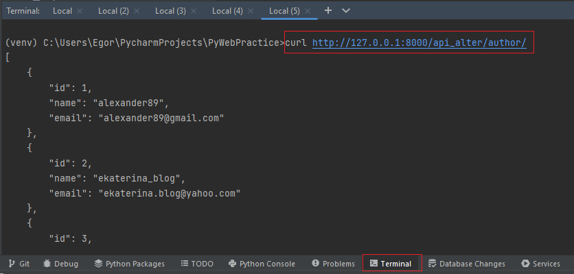
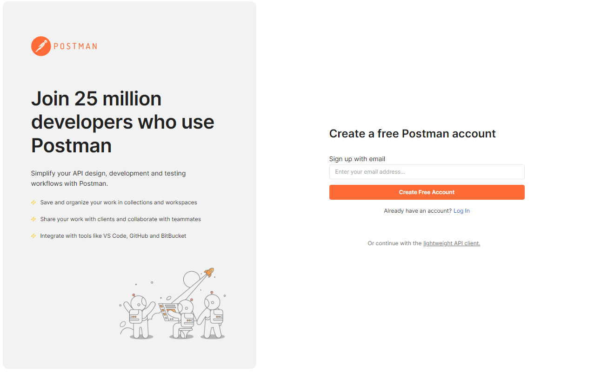
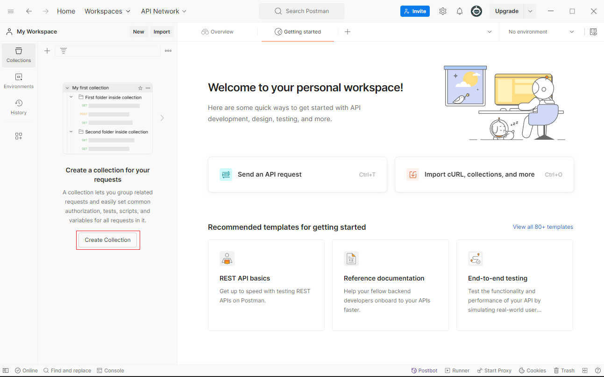
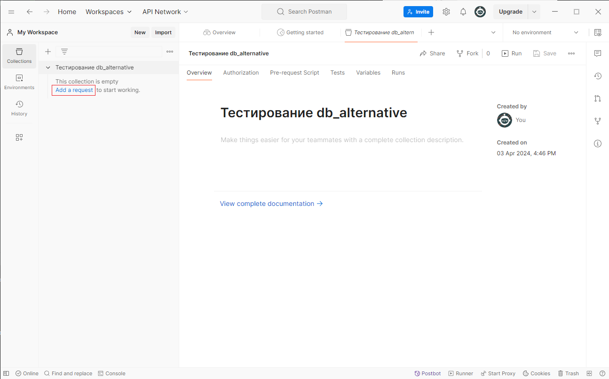
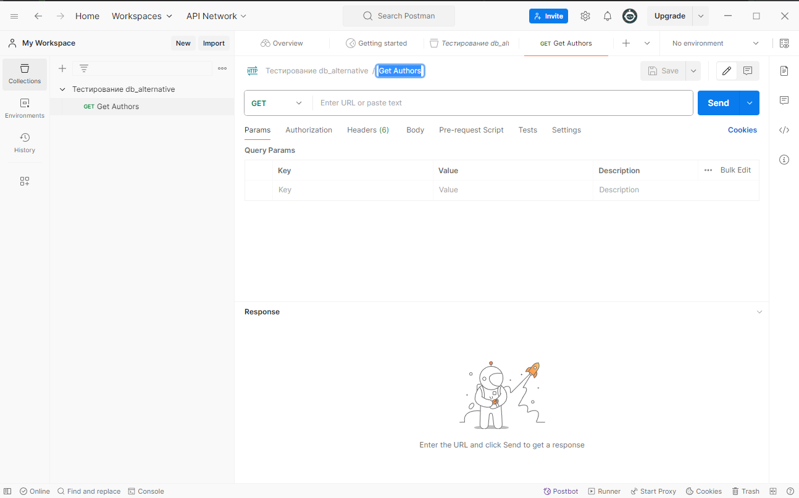
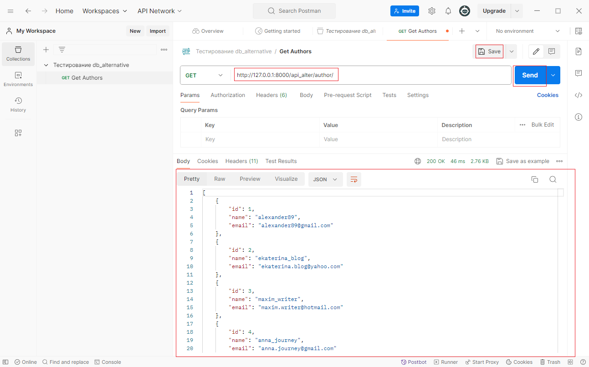

## 1. Работа с API, через view

Перед тем как работать с `Django Rest Framework` сначала посмотрим как бы можно было сделать
решение задачи доступа к ресурсам через методы `GET`, `POST`, `PUT`, `DELETE`, без него.

В приложении `db_train_alternative` во `views.py` пропишем пару отображений для работы с данными.

Создадим возможность работы с БД (отображения, изменения) таблиц приложения `db_train_alternative`

Поработаем над таблицей Author, там всего 2 поля `name` и `email` особых сложностей не должно быть.

Во `views.py` приложения `db_train_alternative` создадим отображение `AuthorREST` возвращающее json,
пропишем пока только GET запрос. Поработаем над базовым классом `View`, чтобы всё прописать руками.

Скопируйте во `views.py` и проанализируйте данный код

```python
from django.http import JsonResponse
from django.views import View
from .models import Author

class AuthorREST(View):
    def get(self, request, id=None):

        if id is None:  # Проверяем, что требуется вернуть всех пользователей
            data = []
            for author in Author.objects.all():
                # Производим сериализацию, т.е. определяем, что именно запишется в данные для преобразования в JSON
                data_author = {'id': author.id,
                               'name': author.name,
                               'email': author.email}
                data.append(data_author)
        else:
            author = Author.objects.filter(id=id)
            if author:  # Если автор такой есть, т.е. QuerySet не пустой
                author = author.first()  # Получаем первого автора из QuerySet, так как он там один
                # Производим сериализацию, т.е. определяем, что именно запишется в данные для преобразования в JSON
                data = {'id': author.id,
                        'name': author.name,
                        'email': author.email}
            else:  # Иначе, так как автор не найден (QuerySet пустой), то возвращаем ошибку, с произвольным текстом,
                # для понимания почему произошла ошибка
                return JsonResponse({'message': f'Автора с id={id} не найдено!'},
                                    status=404,
                                    json_dumps_params={"ensure_ascii": False,
                                                       "indent": 4}
                                    )

        # После того как данные для ответа созданы - возвращаем Json объект с данными
        return JsonResponse(data, safe=False, json_dumps_params={"ensure_ascii": False,
                                                                 "indent": 4})
```

Создайте файл `urls.py` в данном приложении и опишите там пути

```python
from django.urls import path
from .views import AuthorREST


urlpatterns = [
    path('author/', AuthorREST.as_view()),
    path('author/<int:id>/', AuthorREST.as_view()),
]
```

Проверьте работоспособность данного отображения по путям

---
Чтобы вывести всех авторов

http://127.0.0.1:8000/api_alter/author/

---
Чтобы вывести автора с id=10

http://127.0.0.1:8000/api_alter/author/10/

---
Чтобы вывести несуществующего автора

http://127.0.0.1:8000/api_alter/author/0/

---

Формально вот мы и создали свой API endpoint (точку присоединения), чтобы получать нужную нам информацию при GET запросе по адресу
`http://127.0.0.1:8000/api_alter/author/`

Туже информацию мы можем получить через `requests` в python или через `curl`.

Напомним как это делается.

Для работы с `requests` воспользуемся `Python Console`, где пропишем

```python
import requests
response = requests.get('http://127.0.0.1:8000/api_alter/author/')
response.status_code
response.json()
```



Теперь в терминале (`Terminal`) обратимся к тому же адресу, но через `curl`

```text
curl http://127.0.0.1:8000/api_alter/author/
```




Также можно использовать специальные программы на примере Postman, которые позволяют проводить проверку работоспособности
API и её endpoints. 

Скачайте и установите программу [Postman](https://www.postman.com/downloads/) (если вы находитесь в классе ВИШ, то спросите у преподавателя,
где находится файл установки на компьютере). Нужна именно версия на компьютере, а не web версия, так как web версия не позволяет
обрабатывать запросы на localhost.

Зарегистрируйтесь или нажмите на использование легковесного клиента(при использовании легковесного клиента ваши запросы не сохранятся
на сервере Postman, что может быть не так удобно при использовании программы на другом компьютере)



Создадим коллекцию, это своего рода папка с запросами на одну тему



Назовем нашу коллекцию, допустим `Тестирование db_alternative`

Теперь добавим запросов в нашу коллекцию



Назовем наш запрос, допустим `Get Authors` так как планируем создать GET запрос к таблице Author



И в форме прописываем адрес для запроса и нажимаем `Send`

```text
http://127.0.0.1:8000/api_alter/author/
```

В форме ниже получаем результат. Можно сохранить данный запрос, чтобы не нужно было его заново вводить



