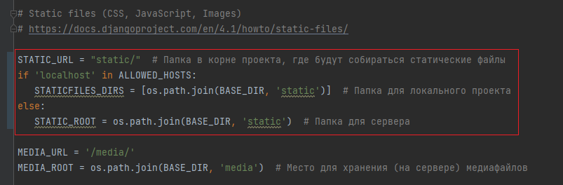

# Оглавление

* 1.Разграничение доступа
  * 1.1. Какие есть разрешения в rest_framework.permissions?
  * 1.2. Что ещё есть в rest_framework.generics?
  * 1.3 Создание представления на GenericApiView
* 2.Использование ViewSet
  * 2.1 Создание представления
    * 2.1.1 ViewSet
    * 2.1.2 GenericViewSet
    * 2.1.3 ReadOnlyModelViewSet
    * 2.1.4 ModelViewSet
  * 2.2 Маршрутизация
  * 2.3 Поддерживание дополнительных действий
  * 2.4 Ограничение поддерживаемых методов для всего представления
* 3.Пагинация
* 4.Фильтрация
  * 4.1 Переопределение get_queryset
  * 4.2 Использование DjangoFilterBackend
* 5.Тестирование
  * 5.1 Тестирование AuthorViewSet
  * 5.2 Самостоятельно (по желанию)
* Необязательный блок

---

# 1. Разграничение доступа

Ранее доступ к API мог получить любой пользователь, да можно ограничить саму функциональность API (разрешить только get методы), допустим, что 
пользователь может только читать информацию, а не изменять её, но это будет касаться вообще всех, а не только отдельных пользователей. Поэтому
после того как мы выяснили что за пользователь пришел к нам на сервер за информацией (аутентификация), необходимо посмотреть какие есть права на данный ресурс
у этого пользователя (авторизация).

В Django разграничение доступа к ресурсам может быть достигнуто с помощью различных механизмов:

* `Authentication` (Аутентификация): Этот механизм позволяет идентифицировать пользователя. 
Django имеет встроенную поддержку различных методов аутентификации, таких как аутентификация по токену, аутентификация по сеансу и базовая аутентификация.


* `Permissions` (Разрешения): После аутентификации Django проверяет разрешения, которые определяют, 
имеет ли пользователь доступ к определенному ресурсу или действию. Разрешения могут быть глобальными или специфичными для объектов.

  > В DRF общие разрешения задаются через классовый атрибут `permission_classes` 

  > Пример (только посмотреть):

  ```python
  from rest_framework.permissions import IsAuthenticated
  from rest_framework.response import Response
  from rest_framework.views import APIView
  
  class ExampleView(APIView):
      permission_classes = [IsAuthenticated]
  
      def get(self, request):
          content = {'message': 'Только аутентифицированные пользователи могут видеть этот контент'}
          return Response(content)
  ```
  > В этом примере `IsAuthenticated` - это разрешение, которое требует, чтобы пользователь был аутентифицирован для доступа к представлению. Если пользователь не аутентифицирован, он получит ошибку HTTP 403 Forbidden.

* `View-level permissions` (Разрешения на уровне представлений): Django позволяет определить права доступа к представлениям. 
Это позволяет вам контролировать, какие пользователи или группы пользователей могут видеть или изменять данные.
  
  > Когда необходимо локализовать какие-то разрешения до отдельных пользователей или групп, то создают свой класс с разрешениями, 
  > наследующийся от `BasePermission`, где переопределяют метод `has_permission` возвращающий `True` если пользователь имеет доступ к ресурсу (представлению),
  > `False` - если нет

  > Пример (только посмотреть):

  ```python
  from rest_framework.permissions import BasePermission
  from rest_framework.response import Response
  from rest_framework.views import APIView
  
  class ExamplePermission(BasePermission):
      def has_permission(self, request, view):
          if request.user.is_superuser:
              return True
          return False
  
  class ExampleView(APIView):
      permission_classes = [ExamplePermission]
  
      def get(self, request):
          content = {'message': 'Этот контент доступен только суперпользователям'}
          return Response(content)
  ```

  > В этом примере создается пользовательское разрешение `ExamplePermission`, которое разрешает доступ только суперпользователям к представлению.

* `Object-level permissions` (Разрешения на уровне объектов): Этот механизм позволяет управлять доступом к отдельным объектам. 
Например, вы можете разрешить только владельцу объекта (или тому, кому дали доступ до объекта) просматривать или изменять его.

  > Когда необходимо локализовать какие-то разрешения до отдельных объектов (строки таблицы), то создают свой класс с разрешениями, 
  > наследующийся от `BasePermission`, где переопределяют метод `has_object_permission` возвращающий `True` если пользователь имеет доступ к просмотру или изменения ресурса (строк таблицы в БД которые создал пользователь),
  > `False` - если нет

  > Пример (только посмотреть):

  ```python
  from rest_framework.permissions import BasePermission
  from .models import YourModel
  
  class ExampleObjectPermission(BasePermission):
      def has_object_permission(self, request, view, obj):
          # Проверяем, имеет ли пользователь доступ к объекту
          return obj.owner == request.user
  
  class ExampleObjectView(APIView):
      permission_classes = [ExampleObjectPermission]
  
      def get(self, request, pk):
          obj = YourModel.objects.get(pk=pk)
          if not request.user.has_perm('view_object', obj):
              return Response({"message": "У вас нет разрешения на просмотр этого объекта"}, status=status.HTTP_403_FORBIDDEN)
          return Response({"message": "Вы имеете доступ к этому объекту"})
  ```

  > `permission_classes` проверяются до того, как будут выполняться методы `get`, `post`, ...

  > В этом примере `ExampleObjectPermission` - это объектное разрешение, которое разрешает доступ к объекту только владельцу объекта. 
Разрешение проверяет, что пользователь, делающий запрос, является владельцем объекта. Однако помимо общего объектного разрешения проверяется то,
что у пользователя есть разрешение просматривать этот контент, вспомните первую практику, где мы вручную в админ панели раздавали разрешения отдельным пользователям или 
группам пользователям на чтение (`view_object`), изменение (`change_object`), добавление (`add_object`), удаление (`delete_object`)

  

  > `owner` - это общепринятый термин, который используется в контексте моделей данных для указания на пользователя или владельца объекта. 
Это не встроенный атрибут Django или Python, поэтому его нужно создать в вашей модели данных, если вы хотите использовать 
его для указания на владельца объекта.

Если хочется почитать как работают разграничения именно в Django,а не DRF, то можно прочитать [здесь](https://colab.research.google.com/drive/1QvHVUhoG3dZqv2ePUxnrtVStsbUSTTsb)(не является обязательным, сделано как лекция)

## 1.1 Какие есть разрешения в rest_framework.permissions?

`rest_framework.permissions` предоставляет несколько встроенных классов разрешений для обеспечения безопасности в вашем API:
Некоторые из наиболее распространенных разрешений включают:

* `IsAuthenticated`: Пользователь должен быть аутентифицирован для доступа к ресурсу.


* `IsAdminUser`: Только пользователи с административными правами могут получить доступ к ресурсу.


* `AllowAny`: Доступ к ресурсу разрешен без аутентификации.


* `IsAuthenticatedOrReadOnly`: Аутентифицированные пользователи могут выполнять любые действия, а неаутентифицированные могут только читать (GET).


* `DjangoModelPermissions`: Разрешения, основанные на правах доступа к модели Django. Разрешает доступ на основе прав доступа add, change и delete модели Django.

  > По умолчанию данное разрешение даёт полный доступ на создание, чтение, изменение и удаление объектов модели. Чтобы ограничить это, то необходимо в самой модели в 
  > метаклассе прописать атрибут permissions и перечислением возможных действий над моделью. Как пример (только посмотреть):
  
  ```python
  class MyModel(models.Model):
      name = models.CharField(max_length=100)
  
      class Meta:
          permissions = [
              ("can_view_mymodel", "Можно посмотреть"),
              ("can_edit_mymodel", "Можно изменить"),
              ("can_delete_mymodel", "Можно удалить"),
          ]
  ```  
  > В данном примере над объектами таблицы MyModel можно совершать только действия над просмотром, изменением и удалением,
  > создать объект в БД не получится. Соответственно используя `permission_classes = [DjangoModelPermissions]`, то в API 
  > будут доступны все разрешения, что есть в модели.

* `DjangoModelPermissionsOrAnonReadOnly`: Аналогично `DjangoModelPermissions`, но неавторизированные пользователи могут просматривать ресурс.


* `DjangoObjectPermissions`: Разрешения, основанные на правах доступа к объекту Django. Позволяет настраивать доступ на основе атрибутов модели Django и прав доступа пользователя.

Все эти классы вы можете указывать в классовом атрибуте `permission_classes` вашего класса представления API.

## 1.2 Использование разрешений

По умолчанию к точке доступа API может подключиться любой желающий. Проверим это выйдя из под пользователя. И проверим доступность 
ресурса как представлению, что писали самостоятельно `AuthorAPIView` используя `APIView`

http://127.0.0.1:8000/api/authors/

`AuthorGenericAPIView` используя `GenericAPIView`

http://127.0.0.1:8000/api/authors_generic/

`AuthorViewSet` используя `ModelViewSet`

http://127.0.0.1:8000/api/authors_viewset/

Тоже самое можно проверить через Postman, любой из них будет работать, так как по умолчанию Postman проверяет доступность без 
авторизации.

Но вот допустим, нам не нравится, что доступ имеют все, допустим некоторая информация конфиденциальная или имеет ценность и хочется показывать 
её только авторизированным пользователям, таким образом добавим возможность проверять разрешения.

### 2.1.1 IsAuthenticated

Во `views.py` приложения `api` добавьте `permission_classes` в ваш `AuthorAPIView` 

```python
from rest_framework import permissions

class AuthorAPIView(APIView):
    permission_classes = [permissions.IsAuthenticated]
```

Теперь проверим доступность адреса

http://127.0.0.1:8000/api/authors/

И увидим, что необходимо авторизоваться


То же самое будет и в Postman


Если авторизироваться, то всё будет нормально, кроме Postman, про это поговорим в главе 2, про аутентификацию.

### 2.1.2 IsAdminUser, IsAuthenticatedOrReadOnly

`IsAdminUser`, `IsAuthenticatedOrReadOnly` работают идентично `IsAuthenticated` только `IsAdminUser` проверяет, что пользователь админ,
а `IsAuthenticatedOrReadOnly` даёт доступ на чтение неавторизированным пользователям, а авторизированным всё что требуется.


### 2.1.3 Пользовательские разрешения

Создадим свой класс разрешений, чтобы учесть все эти действия и добавим этот класс в `permission_classes` класса `AuthorGenericAPIView`


```python
class CustomPermission(permissions.BasePermission):
    """
    Пользователи могут выполнять различные действия в зависимости от их роли.
    """

    def has_permission(self, request, view):
        # Разрешаем только GET запросы для неаутентифицированных пользователей
        if request.method == 'GET' and not request.user.is_authenticated:
            return True

        # Разрешаем GET и POST запросы для аутентифицированных пользователей
        if request.method in ['GET', 'POST'] and request.user.is_authenticated:
            return True

        # Разрешаем все действия для администраторов
        if request.user.is_superuser:
            return True

        # Во всех остальных случаях возвращаем False
        return False


class AuthorGenericAPIView(GenericAPIView, RetrieveModelMixin, ListModelMixin, CreateModelMixin, UpdateModelMixin,
                           DestroyModelMixin):
    queryset = Author.objects.all()
    serializer_class = AuthorModelSerializer

    # Переопределяем атрибут permission_classes для указания нашего собственного разрешения
    permission_classes = [CustomPermission]
    
    # ...
```

Неавторизированный пользователь видит только GET запрос, POST и другие запросы не сделать

http://127.0.0.1:8000/api/authors_generic/

Авторизируемся под обычным пользователем 

username: `platon27`

password: `#8X+DujR!B`

Всех доступных пользователей можете найти в файле `users.json` в корне проекта, если его там нет, то найдете его в папке `tasks/lab5`

Теперь снова зайдем на 

http://127.0.0.1:8000/api/authors_generic/

Затем на 

http://127.0.0.1:8000/api/authors_generic/3/

И увидим, что ничего кроме GET и POST метода нет доступного


Авторизируемся под админом и увидим полный функционал над данными


# Практика окончена

---

# <a name="section-optional-block"></a> <u>Необязательный блок</u> (выполнение по желанию, на результат следующих практик влиять не будет)

# 6. Документирование API

# 7. Использование github для концепции continuous integration (ci)